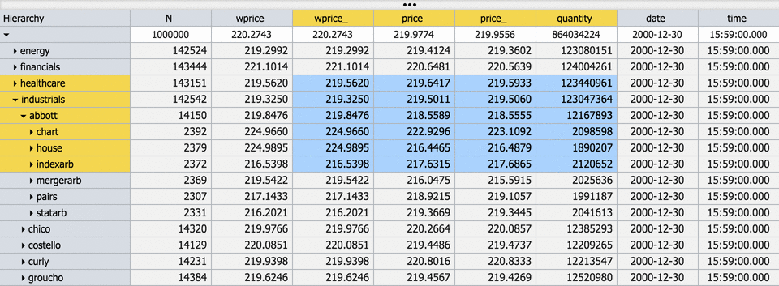
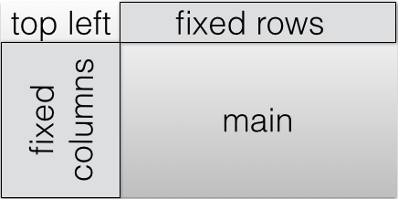
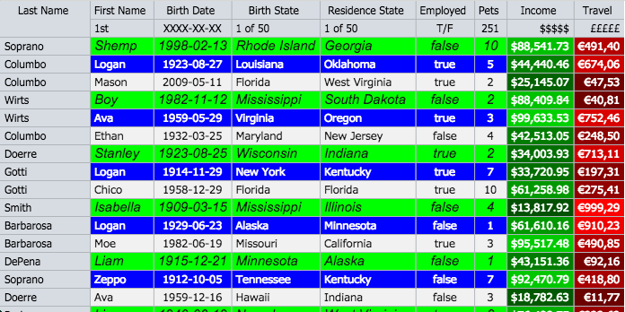

#Hypergrid by OpenFin




See the [polymer component page](http://openfin.github.io/fin-hypergrid/components/fin-hypergrid/#fin-hypergrid) for api documentation and demos.

Watch the [Pivotal Labs presentation](http://www.livestream.com/pivotallabs/video?clipId=pla_01ae6683-c5ee-4567-9278-91524d09550a&utm_source=lslibrary&utm_medium=ui-thumb) recorded on Jan 13th 2015.


## Getting Started
Use the [Hypergrid Openfin Installer](https://dl.openfin.co/services/download?fileName=hypergrid-demo-installer&config=http://openfin.github.io/fin-hypergrid/components/fin-hypergrid/demo.json) to install an openfin startup link and see the demo running on your desktop.   You can also see a few demos..

* [behaviors](http://openfin.github.io/fin-hypergrid/components/fin-hypergrid/demo.html) - the main demo using some paper-elements, showing off all the current behaviors
* [json standalone](http://openfin.github.io/example-fin-hypergrid-behavior-json/) - a side project demonstrating a fin-hypergrid use case of a standalone json behaviour
* [simple standalone](http://openfin.github.io/fin-hypergrid/components/fin-hypergrid/examples/standalone.html) - the simplest example of just a standalone fin-hypergrid with default behavior
* [styled standalone](http://openfin.github.io/fin-hypergrid/components/fin-hypergrid/examples/tt.html) - a slightly more sophisticated styled example of a standalone fin-hypergrid with a json behavior
* [jquery partials](http://openfin.github.io/fin-hypergrid/components/fin-hypergrid/examples/partialtest.html) - an example using jquery dynamic partial loading
* [multi window snap and dock example](https://dl.openfin.co/services/download?fileName=hypergrid-snap-installer&config=http://openfin.github.io/fin-hypergrid/components/fin-hypergrid/examples/hypergrid-snap.json) 

#Hypergrid
The Hypergrid control is a [Google polymer](https://www.polymer-project.org/) [web component](http://webcomponents.org/presentations/), canvas based open source general purpose grid. The purpose of this project is to address the Finance/Big Data community's desire for a high performance, unlimited row data-grid. At the moment, it is in a beta stage and still has ongoing work to be completed. These include bug-fixes/features/automated testing/etc.  Please try it out and let us know what you think.


## Recent 
* [HiDPI](http://www.html5rocks.com/en/tutorials/canvas/hidpi/) mode is now enabled by default and is no longer an attribute but a json startup config property.  The performance issue witnessed in chrome browsers seems to have been fixed.
 
## Pluggable Grid Behaviors
The design makes no assumptions about the data you wish to view which
allows for external data sources as well as external manipulation and
analytics.  Manipulations such as sorting, aggregation, and grouping 
can be achieved using external best of breed high-performant real time tools 
designed for such purposes.  Several grid behavior examples are provided including a [Kx](http://www.kx.com/) Q Kdb+ example.

##The Super Easy Setup
If you just want to see Hypergrid working you can run the [Hypergrid Openfin Installer](https://dl.openfin.co/services/download?fileName=hypergrid-demo-installer&config=http://openfin.github.io/fin-hypergrid/components/fin-hypergrid/demo.json) or just go to the [demo](http://openfin.github.io/fin-hypergrid/components/fin-hypergrid/demo.html).

## Local Setup
The following instructions and project structure is based on the google polymer team best practices for developement of polymer/web-components applications and elements.  It is further documented [here](https://www.polymer-project.org/docs/start/reusableelements.html).

## Deploy your app with fin-hypergrid
The only file that is necessary to deploy the hypergrid is the webcomponent html file, fin-hypergrid.min.html which is a [vulcanized](https://www.polymer-project.org/articles/concatenating-web-components.html) conglomeration of all code and dependencies required by fin-hypergrid.  This file must be imported according to the webcomponents specification.  If you are targeting non webcomponent compliant browsers you will also need the webcomponents.js polyfill found within the polymer project.  An example of this is found [here](https://github.com/openfin/example-fin-hypergrid-behavior-json).  The webcomponents.js file is not necessary if your target platform is a webcomponents compatible browser.  As chrome is currently the only one, we suggest you include this polyfil.  

1. This setup has been tested and works, if you have problems you most likely have security restrictions or proxy issues.  You may need to use sudo for npm and bower installs. Make sure you have internet access, node/npm, grunt-cli, and bower installed and working properly on your machine.
    1. [node installation](http://nodejs.org/download/)
    2. [grunt/grunt-cli installation](http://gruntjs.com/getting-started)
    3. [bower](http://bower.io/)
2. Create a directory 'developement' and cd into it
3. Clone this repo ```git clone https://github.com/openfin/fin-hypergrid.git```
4. cd into the cloned project ```cd fin-hypergrid```
5. Install the npm dependencies ```(sudo) npm install```
6. Install the bower dependencies ```bower install```
7. Start the grunt process ```grunt serve```, after which your browser should automatically open

## Important notes
1. Notice that bower installs many dependencies a level up from the fin-hypegrid project directory, this is the polymer way of developing custom elements.  The actual project directory IS fin-hypergrid, everything is done relative to this, it just needs to live in it's own containing developement directory.

<a name="q-behavior"></a>
##KDB+/Q by [kx](http://kx.com/) systems [demo](http://openfin.github.io/fin-hypergrid/components/fin-hypergrid/demo.html?tab=4) tabs (select either the 'Q' or 'Q Tree' tabs).

This Hypertree + Hypergrid example allows you to define a on the fly custom drill down hierarchy while supporting grouping, aggregations, and sorting in realtime.  The current example demonstrates 20MM updates/second.  The default aggregations available are sum, min, max, first, last, average, weighted average, mean, and standard deviation.  Press options/alt to drag and drop define the visible columns and the drill down hierarchy.

1. The Q tabs will not be populated with data until you run a Q server script that is provided.
2. Make sure q 32 bit free version is installed [Q free version](http://kx.com/software-download.php)
3. Startup either ```q bigtable.q```, ```q sorttable.q```, or install and run the extremely powerfull [Hypertree server found in Stevan Apters github area](https://github.com/stevanapter/hypertree).
4. Make sure grunt serve is running or your browser is pointed to the proper [demo](http://openfin.github.io/fin-hypergrid/components/fin-hypergrid/demo.html?tab=4) tab.
5. If you are running locally, the grunt serve process should automatically refresh your web browser with the q driven grid now populated with data


## Fixed Columns
Hypergrid supports arbitrary numbers of fixed columns.  Simply call the setFixedColumnCount() function on YOUR behavior object. An example of this can be found on the [JSON tab](http://openfin.github.io/fin-hypergrid/components/fin-hypergrid/demo.html?tab=2).

```
var jsonGrid = document.querySelector('#json-example');

var jsonModel = jsonGrid.getBehavior();

jsonModel.setFixedColumnCount(1);

```

## Custom Scrollbars
Hypergrid utilizes a custom scrollbar component so as to not be limited to tables of 33MM pixels in width or height.   In addition to the custom scrollbar, The OpenFin hypergrid utilizes row and column cell scrolling, not pixel scrolling.  This has many benefits that become apparent over time.


##Hypergrid example for displaying RDBMS data

This is an example usage of the hypergrid control looking at the +1MM row postrgres db example from the [greenplum getting started tutorial](http://gpdb.docs.pivotal.io/gs/42/pdf/GP-Getting-Started.pdf).  


For this example to work you'll need to 

* install the [greenplum tutorial db](http://gpdb.docs.pivotal.io/gs/42/pdf/GP-Getting-Started.pdf
* npm install [any-db-postgress](https://github.com/grncdr/node-any-db) and [websocket.io](https://www.npmjs.com/package/websocket.io)
* run the node [script](https://github.com/openfin/fin-hypergrid/blob/master/rdbms/rdbms-example.js) found in the [rdbms](https://github.com/openfin/fin-hypergrid/blob/master/rdbms) directory
* navigate to the q behavior [example](http://openfin.github.io/fin-hypergrid/components/fin-hypergrid/demo.html) and press "reconnect"

feel free to connect this example to any other db that any-db supports (MS SQL, MySQL, Postgres, and SQLite3).
Make sure to npm install the proper any-db-***** interface and edit the config.js file.

# Cell Renderers<a name="cell-renderers"></a>
Cell renderers are easy to create and the default method for generating highly customized dynamic cell content.  They live in an object called a cellProvider which is provided by [YOUR](https://github.com/openfin/fin-hypergrid/blob/master/polymer/js/behaviors/fin-hypergrid-behavior-base.js#L145) behavior object.

There are four areas that have distinct cell renderering override capabilities.  



These areas coorespond to four functions on a [CellProvider](https://github.com/openfin/fin-hypergrid/blob/master/polymer/js/fin-hypergrid-cell-provider.js) found in [YOUR](https://github.com/openfin/fin-hypergrid/blob/master/polymer/js/behaviors/fin-hypergrid-behavior-base.js#L145) behavior object.

```
        getCell: function(config) {
            var cell = this.cellCache.simpleCellRenderer;
            cell.config = config;
            return cell;
        },

        //replace this function in on your instance of cellProvider
        getTopLeftCell: function(config) {
            var cell = this.cellCache.emptyCellRenderer;
            cell.config = config;
            return cell;
        },

        //return the cellRenderer instance for renderering fixed col cells
        getFixedColumnCell: function(config) {
            var cell = this.cellCache.simpleCellRenderer;
            cell.config = config;
            return cell;
        },

        //return the cellRenderer instance for renderering fixed row cells
        getFixedRowCell: function(config) {
            var cell = this.cellCache.simpleCellRenderer;
            cell.config = config;
            return cell;
        },
``` 

#Creating a custom cell renderer.
Creating a cell renderer and using it is very easy, ie:


```
var jsonModel = jsonGrid.getBehavior();

//get the cell cellProvider for altering cell renderers
var cellProvider = jsonModel.getCellProvider();

//replace the main area's getCell functon
cellProvider.getCell = function(config) {
    var renderer = cellProvider.cellCache.simpleCellRenderer;
    config.halign = 'left';
    var x = config.x;

    //setting properties for an entire row, just use modulo operator
    if (y % 3 === 0) {
        //change the background color to green on every 3rd row
        config.bgColor = '#00ff00';
    } else if ((y - 1) % 3 === 0) {
        //change the background color to blue and foreground to white just below every 3rd row
        config.bgColor = '#0000ff';
        config.fgColor = '#ffffff';
    }
    if (x === 0) {
        renderer = cellProvider.cellCache.linkCellRenderer;
    } else if (x === 2) {
        config.halign = 'center';
    } else if (x === 3) {
        config.halign = 'center';
    } else if (x === 6) {
        config.halign = 'center';
    } else if (x === 7) {
        var travel = 60 + Math.round(config.value*150/100000);
        var bcolor = travel.toString(16);
        config.halign = 'right';
        config.bgColor = '#00' + bcolor + '00';
        config.fgColor = '#FFFFFF';
        config.value = accounting.formatMoney(config.value);
    } else if (x === 8) {
        var travel = 105 + Math.round(config.value*150/1000);
        var bcolor = travel.toString(16);
        config.halign = 'right';
        config.bgColor = '#' + bcolor+ '0000';
        config.fgColor = '#FFFFFF';
        config.value = accounting.formatMoney(config.value, "€", 2, ".", ",");
    }

    renderer.config = config;
    return renderer;
};
```

# Column autosizing

You can autosize a column to best fit size by double clicking on the column header.



# Cell Editors

Hypergrid comes with several default cell editors you can easily select, and the ability to create your own. [The javascript code](https://github.com/openfin/fin-hypergrid/tree/master/polymer/js/cell-editors) for the cell editors is found here.

# default cell editors
* [choice](http://openfin.github.io/fin-hypergrid/components/fin-hypergrid/#fin-hypergrid-cell-editor-choice)
<br>
* [color](http://openfin.github.io/fin-hypergrid/components/fin-hypergrid/#fin-hypergrid-cell-editor-color)
<br>
* [date](http://openfin.github.io/fin-hypergrid/components/fin-hypergrid/#fin-hypergrid-cell-editor-date)
<br>
* [slider](http://openfin.github.io/fin-hypergrid/components/fin-hypergrid/#fin-hypergrid-cell-editor-slider)
<br>
* [spinner](http://openfin.github.io/fin-hypergrid/components/fin-hypergrid/#fin-hypergrid-cell-editor-spinner)
<br>
* [textfield](http://openfin.github.io/fin-hypergrid/components/fin-hypergrid/#fin-hypergrid-cell-editor-textfield)
<br>

Creating your own cell editor <a name="creating-cell-editors"></a>
============
You can easily create your own cell editors by subclassing any of the existing cell editors and registering your cell editor with Hypergrid.

* Create a subclass of an existing cell editor.  See [creating polymer components](https://www.polymer-project.org/0.5/docs/polymer/polymer.html) for understanding more about the google best practices for building next generation web components.
```
<link rel="import" href="../fin-hypergrid/html/cell-editors/fin-hypergrid-cell-editor-simple.html">
<polymer-element name="my-number-cell-editor" extends="fin-hypergrid-cell-editor-simple">
  <template>
    <input id="editor" type="number">
  </template>
  <script>
    Polymer({
        alias: 'numberfield',
        selectAll: function() {
            this.input.setSelectionRange(0, this.input.value.length);
        }
    });
  </script>
</polymer-element>
```

* Register it with your hypergrid
```
myHypergrid.initializeCellEditor('my-number-cell-editor');
```

* make use of your new new cell editor
```
var editorTypes = ['choice','numberfield','spinner','date','choice','numberfield','choice','textfield','numberfield'];
myBehavior.getCellEditorAt = function(x, y) {
    var type = editorTypes[x];
    var cellEditor = this.grid.cellEditors[type];
    return cellEditor;
};
```


# Hypergrid configuration

## Modifying various hypergrid features and property defaults
Many of the hypergrid default values and properties can be set through property overriding functions
```addGlobalProperties``` and ```addProperties```.  The current list is.

property|values/examles|description
--------|------|-----------
font|13px Tahoma, Geneva, sans-serif, italic, bold|the default font for main table area
color|rgb(25, 25, 25)|the main foreground color
backgroundColor|rgb(241, 241, 241)|the main background color
foregroundSelColor|rgb(25, 25, 25)|foreground selection Color
backgroundSelColor|rgb(183, 219, 255),|background selection color
topLeftFont|14px Tahoma, Geneva, sans-serif|top left area font
topLeftColor|rgb(25, 25, 25)|top left area foreground color
topLeftBackgroundColor|rgb(223, 227, 232)|top left area background color
topLeftFGSelColor|rgb(25, 25, 25)|top left area foreground selection color
topLeftBGSelColor|rgb(255, 220, 97),|top left area background selection color
fixedColumnFont|14px Tahoma, Geneva, sans-serif|fixed column area default font
fixedColumnColor|rgb(25, 25, 25)|fixed column area foreground color
fixedColumnBackgroundColor|rgb(223, 227, 232)|fixed column area background color
fixedColumnFGSelColor|rgb(25, 25, 25)|fixed column area foreground selection color
fixedColumnBGSelColor|rgb(255, 220, 97),|fixed column area background selection color
fixedRowFont|14px Tahoma, Geneva, sans-serif|fixed row area font
fixedRowColor|rgb(25, 25, 25)|fixed row area foreground color
fixedRowBackgroundColor|rgb(223, 227, 232)|fixed row area background color
fixedRowFGSelColor|rgb(25, 25, 25)|fixed row area foreground selection color
fixedRowBGSelColor|rgb(255, 220, 97),|fixed row area background selection color
backgroundColor2|rgb(201, 201, 201)|secondary background color
lineColor|rgb(199, 199, 199)|grid lines color
voffset|0|offset from top of all text
editorActivationKeys|['esc','alt','a','b','c']|what keys open and close the column editor
scrollbarHoverOver|visible/hidden|shadow class name on hover over
scrollbarHoverOff|visible/hidden|shadow class name on hover off
scrollingEnabled|true/false|enable/disable scrolling
fixedRowAlign|left/center/right|fixed row area text alignment
fixedColAlign|left/center/right|fixed column area text alignment
cellPadding|5|left and right padding around text inside the cells
gridLinesH|true/false|draw the horizontal grid lines
gridLinesV|true/false|draw the vertical grid lines
defaultRowHeight|20|the default row height in pixels
defaultFixedRowHeight|20|the default row height in pixels of the fixed row area
defaultColumnWidth|100|the default column width
defaultFixedColumnWidth|100|the default column width of the fixed column area
repaintIntervalRate|15|how often the canvas checks the repaint flag, set 0 to never check
repaintImmediately|false|cause painting to happen immediately within the same micro task, if true repaintIntervalRate should be set to 0
useBitBlit|false/true|enable or disable double buffering
useHiDPI|true/false|make use of hi dpi displays (defaults to true)
## example usage
```
    var lnfOverrides = {
        font: '13px Tahoma, Geneva, sans-serif',
        color: '#ffffff',
        backgroundColor: '#505050',
        foregroundSelColor: 'rgb(25, 25, 25)',
        backgroundSelColor: 'rgb(183, 219, 255)',

        topLeftFont: '14px Tahoma, Geneva, sans-serif',
        topLeftColor: 'rgb(25, 25, 25)',
        topLeftBackgroundColor: 'rgb(223, 227, 232)',
        topLeftFGSelColor: 'rgb(25, 25, 25)',
        topLeftBGSelColor: 'rgb(255, 220, 97)',

        fixedColumnFont: '14px Tahoma, Geneva, sans-serif',
        fixedColumnColor: 'rgb(25, 25, 25)',
        fixedColumnBackgroundColor: 'rgb(223, 227, 232)',
        fixedColumnFGSelColor: 'rgb(25, 25, 25)',
        fixedColumnBGSelColor: 'rgb(255, 220, 97)',

        fixedRowFont: '11px Tahoma, Geneva, sans-serif',
        fixedRowColor: '#ffffff',
        fixedRowBackgroundColor: '#303030',
        fixedRowFGSelColor: 'rgb(25, 25, 25)',
        fixedRowBGSelColor: 'rgb(255, 220, 97)',

        backgroundColor2: '#303030',
        lineColor: '#707070',
        voffset: 0,
        editorActivationKeys: ['esc', 'alt'],
        scrollbarHoverOver: 'visible',
        scrollbarHoverOff: 'visible',
        scrollingEnabled: true,

        defaultRowHeight: 20,
        defaultFixedRowHeight: 20,
        defaultColumnWidth: 100,
        defaultFixedColumnWidth: 100
    };

    var table = document.querySelector('#myHypergrid');

    //to apply to a specific table
    table.addProperties(lnfOverrides);

    //to apply for all tables
    //table.addGlobalProperties(lnfOverrides);
```
# Hypergrid events

You can listen to various events that occur within the Hypergrid.  Take note in order to attach listeners you must call 'addFinListener' on the grid.  Each event has a detail object with various bits of information about the event.  Please contact us if there are more events you need and we'll be happy to put them in.

event|description
-----|-----------
fin-before-cell-edit|this is fired just before a cell edit occurs
fin-after-cell-edit|this is fired just after a cell edit occurs
fin-selection-changed|this is fired whenever the selection changes
fin-scroll-x|this is fired on any scroll in the horizontal dimension
fin-scroll-y|this is fired on any scroll in the vertical dimension
fin-cell-click|this is fired on cell click
fin-grid-rendered|this is fired after a repaint occurs

```
    var jsonModel = document.querySelection('#json-grid');
    jsonModel.addFinListener('fin-cell-click', function(event) {
        console.log('fin-cell-click', event.detail);
    });
```


# JSON behavior

By far the most common behavior to use will be the JSON behavior.  If you're not sure which one to start with, select this one.

## Populating a JSON behavior with data

To populate the json behavior with data simply provide hypergrid with an array of same shaped objects.   
```
    var myJSONBehavior = document.querySelector('#myHypergrid').getBehavior();
    myJSONBehavior.setData([
        {   
            first_name:'moe',
            last_name: 'stooge',
            birth_date: '1920-01-01'
        },
        {   
            first_name:'larry',
            last_name: 'stooge',
            birth_date: '1922-05-05'
        },
        {   
            first_name:'curly',
            last_name: 'stooge',
            birth_date: '1924-03-07'
        },
    ]);
```
## Specifying fields and headers for a JSON behavior

There are several ways to specify fields and headers with hypergrid.

* Let hypergrid default them.  Hypergrid will inspect the first object in the data array and use all fields it finds.  It will create header labels by uppercasing and placing spaces between the words delimitted by camelcase, dashes, or underscores.
    * moeLarryCurly -> Moe, Larry, Curly
    * moe-larry-curly -> Moe, Larry, Curly
    * moe_larry_curly -> Moe, Larry, Curly
* Specify fields and headers using setFields and setHeaders
```
    myJSONBehavior.setData(myData);
    myJSONBehavior.setHeaders(['header one','header two','header three','header four']);
    myJSONBehavior.setFields(['one','two','three','four']);
```
* Specify fields and headers using setColumns ala slickgrid API.
```
    myJSONBehavior.setData(myData);
    myJSONBehavior.setColumns([
        {
            title: 'First Name',
            field: 'first_name',
        },
        {
            title: 'Last Name',
            field: 'last_name',
        },
        {
            title: 'Birth Date',
            field: 'birth_date',
        }
    ]);
```

# JSON behavior totals rows

adding totals rows just under the column headers with Hypergrid is extremely simple.  Call setTotals function on the JSON behavior and pass in an array of arrays of the content you want displayed.

```
    var totals =
        [['','1st',251,'XXXX-XX-XX','1 of 50','1 of 50','T/F','$$$$$','£££££']];

    myJSONBehavior.setTotals(totals);

    //update the totals and see the change
    totals[0][2] = 300;
    myJSONBehavior.changed();

```

## JSON behavior table state
Hypergrid allows you to snapshot the user configured state and then reapply it later(memento pattern) this includes.
* column order
* column widths
* row heights
* sorted column asc/des

to do this

1. configure the table the way you would like
2. call ```var state = myGrid.getState();```
3. save the state object however you like, json/local storage/mongodb/etc...
4. later on, call ```myGrid.setState(state);``` with the previous state object to return 


the above table will produce the below state object 

```javascript
{  
   "columnIndexes":[8,7,1,3,2,4,6],                 //column order
   "fixedColumnIndexes":[0],                        //fixed columns order
   "hiddenColumns":[5,0],                           //hidden column indexes
   "columnWidths":[66,50,51,81,73,96,78,74,60],     //
   "fixedColumnWidths":[53],                        //
   "rowHeights":{"1":46,"3":51,"5":51,"7":50},      //
   "fixedRowHeights":{},                            //
   "sorted":[0,0,0,0,0,0,0,1,0]                     //1 ascending, 2 descending
}
```
state objects can be created programmatically or by hand and applied.  This is how you may pre configure your grid properties.

## Column Picker
Hypergrid has a column picker that allows you to drag and drop columns for configuring which are visible.  You can also reorder the columns here.
press alt/option to open the column picker, you can press alt/option or esc to close it


Updating Hypergrid Data with the JSON Behavior  <a name="updating-data"></a>
======================
It's really easy to see your data updates manifest in the hypergrid with the JSON behavior. You don't need to call setData again.

1. Update the underlying javascript object field.
2. Call the 'changed()' function on the json behavior object.
```
    var myData = [
        {   
            first_name:'moe',
            last_name: 'stooge',
            birth_date: '1920-01-01'
        },
        {   
            first_name:'larry',
            last_name: 'stooge',
            birth_date: '1922-05-05'
        },
        {   
            first_name:'curly',
            last_name: 'stooge',
            birth_date: '1924-03-07'
        },
    ];

    var myJSONBehavior = document.querySelector('#myHypergrid').getBehavior();
    myJSONBehavior.setData(myData);
    
    //update my data
    myData[0].first_name = 'Groucho';
    myData[0].last_name = 'Marx';
    
    //tell the behavior it's underlying data has changed
    myJSONBehavior.changed();

```

Cells as Links
======================
Hypergrid supports clickable link cells, to achieve this you need to...

* register a listener to the table for 'fin-cell-click'
```
jsonGrid.addFinEventListener('fin-cell-click', function(e){
    var cell = e.detail.cell;
    if (cell.x !== 0) {
        return;
    }
    alert('fin-cell-click at (' + cell.x + ', ' + cell.y + ')');
});
```
* override the getCursorAt method on behavior to be a function that returns the string of the name of the cursor for the column with the links
```
jsonModel.getCursorAt = function(x,y) {
    if (x === 0) {
        return 'pointer'
    } else {
        return null;
    }
};
```
* override the cell-provider to return the linkRenderer for the desired link columns
```
cellProvider.getCell = function(config) {
    var renderer = cellProvider.cellCache.simpleCellRenderer;
    config.halign = 'left';
    var x = config.x;
    if (x === 0) {
        renderer = cellProvider.cellCache.linkCellRenderer;
    } else if (x === 2) {
    ...
    ...
    ...
```
 
see the 'Last Name' column of the JSON tab in the main example;

<a name="hypergrid-excel-integration"></a>
Hypergrid Excel Integration
======================

There is an example integration between the Hypergrid and Microsoft Excel over the OpenFin InterApplicationBus. The example only works when running Hypergrid in the OpenFin Runtime, which is installed from the [Hypergrid Openfin Installer](https://dl.openfin.co/services/download?fileName=hypergrid-demo-installer&config=http://openfin.github.io/fin-hypergrid/components/fin-hypergrid/demo.json).

Keep in mind the Excel integration is NOT a Hypergrid specific feature but is a feature that allows any OpenFin application to communicate with Excel via the InterApplicationBus.

Assumptions

* Windows machine
* Running in an openfin container

Steps to Excel-Hypergrid Integration Demo

1. Download and Unzip [excel.zip](https://github.com/openfin/fin-hypergrid/blob/master/excel.zip)
2. Launch Hypergrid Demo application
3. Launch Excel
4. Open either FinDesktopAddin-packed or FinDesktopAddin64-packed depending for your Excel
      * Enable plug for the session
5. Open hypergrid.xls file from unzipped directory
6. Select a cell(s) in Hypergrid Demo Application

The excel-integration demo consists of an OpenFin app, and a C# XLL plugin built using the Excel-DNA infrastructure. The Excel-DNA infrastructure provides a C++ XLL plugin which exposes the Excel Object Model to C# dll's and code which can be configured using a manifest file (.dna).  Here are the steps to setting up the integration demo...

<a name="excel-json-behavior-example"></a>

Hypergrid Excel JSON Behavior Example Application
=========================
 
Because so many folks have been asking for an example of JSON with Excel, we've provided a bare bones example that should help you out understanding how it all works.  [Here is the link for the installer.](https://dl.openfin.co/services/download?fileName=hypergrid-json-demo-installer&config=http://openfin.github.io/fin-hypergrid/components/fin-hypergrid/examples/excel-json-behavior.json)  The example uses the same FinDesktopAddin-packed and hypergrid.xls file from the above [Hypergrid Excel Integration](#hypergrid-excel-integration) above.  The html for the example is [here.](https://github.com/openfin/fin-hypergrid/blob/master/examples/excel-json-behavior.html)


Fin-Hypergrid-Excel plugin element
=========================

To enable excel messaging for your behavior, embed the fin-hypergrid-excel tag inside your grid tag

```
<fin-hypergrid>
    <fin-hypergrid-behavior-default></fin-hypergrid-behavior-default>
    <fin-hypergrid-excel
            publish="onSelect",
            subscribe="onExcelChange"
            interval="500"
            logging=false>
    </fin-hypergrid-excel>
</fin-hypergrid>
```
All the attributes listed above default to the values listed above.  These properties can be described as follows...

attribute|values/examles|description
--------|------|-----------
publish|any valid javascript identifier<br>onSelect<br>onJSONSelect|this is the topic used to [publish the cell data messages to the InterApplicationBus ](http://cdn.openfin.co/jsdocs/3.0.1.5/fin.desktop.module_InterApplicationBus.html#publish).  This value MUST be the same as the second argument in the Excel addin function <a class="hovertrigger">=FinDesktopSync("hypergrid-demo","onSelect","").</a><div class="hoverdiv"></div>
subscribe|any valid javascript identifier<br>onExcelChange<br>onJSONExcelChange|this is the topic used to [subscribe to cell data messages from the InterApplicationBus ](http://cdn.openfin.co/jsdocs/3.0.1.5/fin.desktop.module_InterApplicationBus.html#subscribe). This should be left to the default of "onExcelChange" unless you want to push the cell data to other InterApplicationBus endpoints. 
interval|integer value in milliseconds<br>500<br>1000|millisecond interval to [publish the cell data messages to the InterApplicationBus ](http://cdn.openfin.co/jsdocs/3.0.1.5/fin.desktop.module_InterApplicationBus.html#publish)
logging|Boolean value<br>true<br>false|enable or disable logging of messages and errors to the console

<a class="hovertrigger"></a><div class="hoverdiv"></div>
Another important dependency to be aware of is the
<a class="hovertrigger">OpenFin startup_app name in the configuration.json file</a><div class="hoverdiv"></div>
MUST be the same as the first argument to the Excel function
<a class="hovertrigger">=FinDesktopSync("hypergrid-demo","onSelect","").</a><div class="hoverdiv"></div>


Excel Integration Links
=====

http://exceldna.codeplex.com/

https://exceldna.codeplex.com/documentation

http://nodejs.org/download/

## Road Map

* add filter support
* add grouping
* local storage for layout values
* events should work for mobile
* add ink effects
* Test suite for all components and upstream dependency projects
* Tooltip support
* context menu support
* Layer abstraction
* Move to gulp
* refactor behaviors to controller-chain and model
* instant edit
* support expandable sub-content
* move this todo to github issues

-- done --
* tree-table support
* Column autosizing
* Hover event support
* Page up/down buttons
* add column selection/reordering to all behaviors
* Fix live reload on file change edge conditions
* GridBehaviors for other data sources
* fix mouse event locations when zoomed
* fix scrollbar/scrolled mouse events are broken
* fix events to work well with mobile
* refactor column selection feature to other behaviors
* rafactor features to be self contained/column selector

## Feature List
* tree-table support
* Column autosizing
* Hover event support
* clickable hyperlink cells
* polymer web component based
* material design compliant
* high performant canvas based rendering
* low cpu and memory usage
* Arbitrary row/column sizes
* Drag and Drop column resizing and animated reordering
* Drag and Drop row resizing
* Memento based table state retention
* Data per cell can be anything (text, numerical, nested arrays, etc.)
* Shape/size in both pixel and row/column count can change dynamically
* Infinite scrolling row/col through external high performant data sources (see Q examples)
* Copy to paste buffer selected cells
* Multi-rectangle based selection model
* Mouse driven dragging selections
* Shift/control selection augmentation
* Arbitrary fixed columns and/or rows
* configurable via passed in properties
* polymer themes supported
* Fast arrow key navigation
* Non-linear accelerated vertical key navigation
* Custom scrollbar implementation for infinite scroll of large data sets
* Cell based scrolling (not pixel) 
* Pluggable behavior based eventing
* In place editing mechanism using html5 overlayed components
* Q\kdb+ GridBehavior examples provided. 
    1. 100MM row example
    2. 1MM row sortable example
    3. 1MM row analytic tree/pivot table example
* Simple in memory based GridBehavior example provided
* JSON example
* Easily customizable and extensible cell rendering
* Npm/grunt-based full featured dev environment

