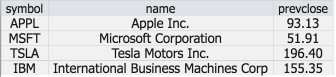

**fin-hypergrid** is an ultra-fast HTML5 grid presentation layer, achieving its speed by rendering (in a canvas tag) only the currently visible portion of your (virtual) grid, thus avoiding the latency and life-cycle issues of building, walking, and maintaining a complex DOM structure.


### Current Release (1.0.8 - 8 August 2016)

The current version replaces last year's [prototype version](https://github.com/openfin/fin-hypergrid/tree/polymer-prototype), which was built around Polymer. It is now completely "de-polymerized" and is being made available as:
* An [npm module](https://www.npmjs.com/package/fin-hypergrid) for use with browserify.
* A single JavaScript file [fin-hypergrid.js](https://openfin.github.io/fin-hypergrid/build/fin-hypergrid.js) you can reference in a `<script>` tag.

_For a complete list of changes, see the [version history](version-history.md)._

### Demos

##### Developer Tutorial

This [tutorial](https://openfin.github.io/fin-hypergrid) is a tool that shows developers how to use Hypergrid and implement its features.

##### Hyperblotter

Hyperblotter is a demo app that shows the capabilities of both OpenFin and Hypergrid.

Check out the Table view on Hyperblotter on a Windows machine via [this installer](https://dl.openfin.co/services/download?fileName=Hyperblotter&config=http://cdn.openfin.co/demos/hyperblotter/app.json).


### Features


##### Future development

* Tree-view presentation for remotely aggregated data

###### The Filtering & Analytics (sorting & aggregation) modules provided will be broken out of Hypergrid

* We are currently working on expanding the API to enable application developers to easily provide their own functionality
* Hypergrid will have no opinion on how the underlying data should be pivoted, but will remain capable of presenting pivoted data
* The current filtering and analytics modules will become separate npm modules/JavaScript files that can be forked and further developed

### Integrating

[This](https://openfin.github.io/fin-hypergrid/example.js) is a basic example that embeds fin-hypergrid:
```html
<!DOCTYPE html>
<html>
<head>
    <meta http-equiv="Content-Type" content="text/html;charset=utf-8" >
</head>
<body>

    <div id="fin-grid"></div>

    <script src="https://openfin.github.io/fin-hypergrid/build/fin-hypergrid.js"></script>
    
    <script>
        var data = [
           { symbol: 'APPL', name: 'Apple Inc.', prevclose: 93.13 },
           { symbol: 'MSFT', name: 'Microsoft Corporation', prevclose: 51.91 },
           { symbol: 'TSLA', name: 'Tesla Motors Inc.', prevclose: 196.40 },
           { symbol: 'IBM', name: 'International Business Machines Corp', prevclose: 155.35 }
        ];
        
        var grid = new fin.Hypergrid('#fin-grid', { data: data });
        
        grid.addProperties({
            showRowNumbers: false,
            showFilterRow: false
        });
    </script>
</body>
</html>
```

Will look like:



### Documentation

Essential documentation and examples will be added to this page in the near future.

We are also maintaining [online API documentation](http://openfin.github.io/fin-hypergrid/doc/Hypergrid.html) for all public objects and modules. This documentation is necessarily a on-going work-in-progress.

(Cell editor information can be found [here](http://openfin.github.io/fin-hypergrid/doc/tutorial-cell-editors.html).)

(Cell Rendering information can be found [here](http://openfin.github.io/fin-hypergrid/doc/tutorial-cell-renderer.html).)

Hypergrid global configurations can be found [here](http://openfin.github.io/fin-hypergrid/doc/module-defaults.html). Use it for modifying various hypergrid features and property defaults.

### Contributors

Developers interested in contributing to this project should submit pull requests against the `develop` branch.
