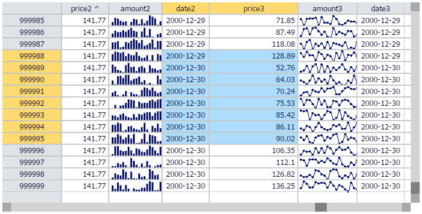

#Hypergrid by OpenFin




See the [polymer component page](http://openfin.github.io/fin-hypergrid/components/fin-hypergrid/) for api documentation and demos.

## Getting Started
Use the [Hypergrid Openfin Installer](https://dl.openfin.co/services/download?fileName=hypergrid-demo-installer&config=http://openfin.github.io/fin-hypergrid/components/fin-hypergrid/demo.json) to install an openfin startup link and see the demo running on your desktop.   You can also see a demo of it [here](http://openfin.github.io/fin-hypergrid/components/fin-hypergrid/demo.html) and [here](http://openfin.github.io/example-fin-hypergrid-behavior-json/)

#Hypergrid
The Hypergrid control is a [Google polymer](https://www.polymer-project.org/) [web component](http://webcomponents.org/presentations/), canvas based open source general purpose grid. The purpose of this project is to address the Finance/Big Data community's desire for a high performance, unlimited row data-grid. At the moment, it is in a beta stage and still has ongoing work to be completed. These include bug-fixes/features/automated testing/etc.  Please try it out and let us know what you think.


## Pluggable Grid Behaviors
The design makes no assumptions about the data you wish to view which
allows for external data sources as well as external manipulation and
analytics.  Manipulations such as sorting, aggregation, and grouping 
can be achieved using external best of breed high-performant real time tools 
designed for such purposes.  Several grid behavior examples are provided including a [Kx](http://www.kx.com/) Q Kdb+ example.

##The Super Easy Setup
If you just want to see Hypergrid working you can run the [Hypergrid Openfin Installer](https://dl.openfin.co/services/download?fileName=hypergrid-demo-installer&config=http://openfin.github.io/fin-hypergrid/components/fin-hypergrid/demo.json) or just goto the [demo](http://openfin.github.io/fin-hypergrid/components/fin-hypergrid/demo.html).

## Local Setup
The following instructions and project structure is based on the google polymer team best practices for developement of polymer/web-components applications and elements.  It is further documented [here](https://www.polymer-project.org/docs/start/reusableelements.html).

## Deploy your app with fin-hypergrid
The only js file that is necessary to deploy the hypergrid is fin-hypergrid.min.js which is a [vulcanzed](https://www.polymer-project.org/articles/concatenating-web-components.html) conglomeration of all code and dependencies required by fin-hypergrid.  An example of this is found [here](https://github.com/openfin/example-fin-hypergrid-behavior-json).  The webcomponents.js file is not necessary if your target platform is a webcomponents compatible browser.  As chrome is currently the only one, we suggest you include this polyfil.  

1. This setup has been tested and works, if you have problems you most likely have security restrictions or proxy issues.  You may need to use sudo for npm and bower installs. Make sure you have internet access, node/npm, grunt-cli, and bower installed and working properly on your machine.
    1. [node installation](http://nodejs.org/download/)
    2. [grunt/grunt-cli installation](http://gruntjs.com/getting-started)
    3. [bower](http://bower.io/)
2. Create a directory 'developement' and cd into it
3. Clone this repo ```git clone https://github.com/openfin/fin-hypergrid.git```
4. cd into the cloned project ```cd fin-hypergrid```
5. Install the npm dependencies ```(sudo) npm install```
6. Install the bower dependencies ```bower install```
7. Start the grunt process ```grunt serve```, after which your browser should automatically open

## Important notes
1. Notice that bower installs many dependencies a level up from the fin-hypegrid project directory, this is the polymer way of developing custom elements.  The actual project directory IS fin-hypergrid, everything is done relative to this, it just needs to live in it's own containing developement directory.

##Q by [kx](http://kx.com/) systems [demo](http://openfin.github.io/fin-hypergrid/components/fin-hypergrid/demo.html) tab (select the 'Q' tab)
1. The Q tab will not be populated with data until you run a Q server script that is provided.
2. Make sure q 32 bit free version is installed [Q free version](http://kx.com/software-download.php)
3. Startup either bigtable.q ```q bigtable.q``` or sorttable.q ```q sorttable.q```
4. Make sure grunt serve is running
5. If you are running locally, the grunt serve process should automatically refresh your web browser with the q driven grid now populated with data

## Custom Scrollbars
Hypergrid utilizes a custom scrollbar component so as to not be limited to tables of 33MM pixels in width or height.   In addition to the custom scrollbar, The OpenFin hyergrid utilizes row and column cell scrolling, not pixel scrolling.  This has many benefits that become apparent over time.


## Road Map 
1. Test suite for all components and upstream dependency projects
2. Continued bug-fixing, refactoring, documentation and cleanup of the existing code base
4. GridBehaviors for other data sources
5. Column reordering/resizing/autosizing
6. Hover event support
7. Tooltip support 
8. Layer abstraction
9. Continue adding features

## Feature List
* High performant canvas based
* Arbitrary row/col sizes
* Data per cell can be anything (text, numerical, nested arrays, etc.)
* Shape/size in both pixel and row/column count can change dynamically
* Infinite scrolling row/col through external high performant data sources (see Q examples)
* Copy to paste buffer selected cells (work in progress...)
* Multi-rectangle based selection model
* Mouse driven dragging selections
* Shift/control selection augmentation
* Fast arrow key navigation
* Non-linear accelerated vertical key navigation
* Custom scrollbar implementation for infinite scroll of large data sets
* Cell based scrolling (not pixel) 
* Pluggable behavior based eventing
* In place editing mechanism using html5 overlayed components
* Simple Q-based GridBehavior example provided with 2 q scripts. 100MM example, and 1MM sortable example
* Simple in memory based GridBehavior example provided
* Easily customizable and extensible cell rendering
* Npm/grunt-based full featured dev environment
* ...

hypergrid-excel-integration
======================

There is an example integration between the Hypergrid and Microsoft Excel over the OpenFin InterApplicationBus. The example only works when running Hypergrid in the OpenFin Runtime, which is installed from the [Hypergrid Openfin Installer](https://dl.openfin.co/services/download?fileName=hypergrid-demo-installer&config=http://openfin.github.io/fin-hypergrid/components/fin-hypergrid/demo.json).

The excel-integration demo consists of an OpenFin app, and a C# XLL plugin built using the Excel-DNA infrastructure. The Excel-DNA infrastructure provides a C++ XLL plugin which exposes the Excel Object Model to C# dll's and code which can be configured using a manifest file (.dna).  Here are the steps to setting up the integration demo...

Assumptions
* Windows machine
* .NET framework installed

Steps to Integration Demo

1. Download [excel.zip](http://openfin.github.io/fin-hypergrid/components/fin-hypergrid/excel.zip)
2. Unzip files to a local folder 
3. Launch the *FinDesktopAddin* located at 
    64 Bit  <local folder>/desktop-cs-excal/ExcelRtdAddin/bin/x64/Release/
    86 Bit  <local folder>/desktop-cs-excal/ExcelRtdAddin/bin/x64/Release/
4. Start Hypergrid
5. Open Hypergrid.xls stored in <local folder>

Steps 3-5 need to be repeated each time you want to run the demo. Alternatively, you can manage this addin so that step 3 does not need to be repeated Excel File -> Options -> Add-Ins -> Manage Addins -> Browse -> Select <local folder>/desktop-cs-excel/ExcelRtdAddin/bin/x64/Release/*FinDesktopAddin* 

The Excel-DNA infrastructure provides a C++ XLL plugin which exposes the Excel Object Model to C# dll's and code which can be configured using a manifest file (.dna)

The excel folder ([download excel.zip](http://openfin.github.io/fin-hypergrid/components/fin-hypergrid/excel.zip)) contains the source code and implementation of the OpenFin C# adapter which connects to the OpenFin runtime over WebSockets, and exposes the InterApplicationBus to C# code.  Download this zip file and unzip it into a new directory on your machine.

The *desktop-cs-excel* folder contains the Excel-DNA interfaces in the *ExcelRtdAddin/RtdServer.cs* file, and also contains a complete distribution of the DNA source code in the Dna subfolder.

*ExcelRtdAddin/RtdServer.cs* combines the ExcelRtdServer interface with the asynchronous OpenFin DesktopStateListener interfaces to expose a higher level set of classes DesktopRtdServer and SubscriptionRtdServer which can be used to integrate Excel functionality with OpenFin.  The SelectionRtdServer class implements the grid specifc behavior using a simple JSON serialisation of the selection, and provides updates from Excel using delegates on the ExcelDnaUtil.Application object and its associated worksheets.


Running the Excel Integration Example
=======

To test that the Excel-DNA infrastructure is working on your system first load the appropriate 32bit or 64bit .xll file from the *desktop-cs-excel/Dna/Distribution/* folder.  You should be prompted with a security warning to enable the addin, after which you can create a new worksheet and enter the following formula in a cell (as described in ExcelDna.dna):

*=AddThem(5,10)*

You should see 15 as the result.

If this is working then you can proceed to installing the OpenFin runtime and setting up the grid application to be hosted locally.  You can also use the default remotely hosted grid if you like, but its better for learning to use the locally hosted version.

Run the hypergrid installer from here [here.](https://dl.openfin.co/services/download?fileName=hypergrid-demo-installer&config=http://openfin.github.io/fin-hypergrid/components/fin-hypergrid/demo.json)

This will add a shortcut to your desktop which will connect to the remote grid using the default url.  

Once verified you can launch either the x86 or x64 OpenFin .xll addin:

*desktop-cs-excel/ExcelRtdAddin/bin/x86/Release/FinDesktopAddin.xll*

*desktop-cs-excel/ExcelRtdAddin/bin/x64/Release/FinDesktopAddin64.xll*


Then open the xlsx file 'hypergrid.xlsx' found in the root of the downloaded excel.zip

This will show two worksheets, the first sheet should now show data from the grid when you click a cell or if you hold shift and click multiple cells.  You can edit a cell which has a value in Excel and that change will be reflected in the equivalent grid cell.


Excel Integration Links
=====

http://exceldna.codeplex.com/

https://exceldna.codeplex.com/documentation

http://nodejs.org/download/

