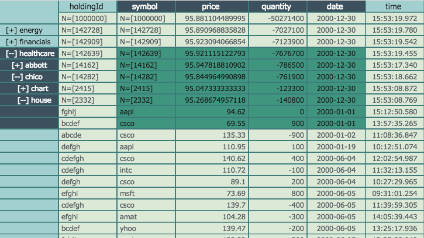
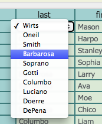
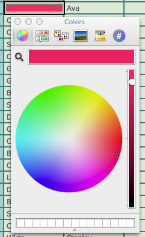
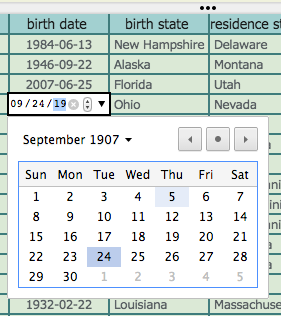
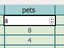
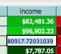

#Hypergrid by OpenFin


See the [polymer component page](http://openfin.github.io/fin-hypergrid/components/fin-hypergrid/#fin-hypergrid) for api documentation and demos.

Watch the [Pivotal Labs presentation](http://www.livestream.com/pivotallabs/video?clipId=pla_01ae6683-c5ee-4567-9278-91524d09550a&utm_source=lslibrary&utm_medium=ui-thumb) recorded on Jan 13th 2015.


## Getting Started
Use the [Hypergrid Openfin Installer](https://dl.openfin.co/services/download?fileName=hypergrid-demo-installer&config=http://openfin.github.io/fin-hypergrid/components/fin-hypergrid/demo.json) to install an openfin startup link and see the demo running on your desktop.   You can also see a few demos..

* [behaviors](http://openfin.github.io/fin-hypergrid/components/fin-hypergrid/demo.html) - the main demo using some paper-elements, showing off all the current behaviors
* [json standalone](http://openfin.github.io/example-fin-hypergrid-behavior-json/) - a side project demonstrating a fin-hypergrid use case of a standalone json behaviour
* [simple standalone](http://openfin.github.io/fin-hypergrid/components/fin-hypergrid/examples/standalone.html) - the simplest example of just a standalone fin-hypergrid with default behavior
* [styled standalone](http://openfin.github.io/fin-hypergrid/components/fin-hypergrid/examples/tt.html) - a slightly more sophisticated styled example of a standalone fin-hypergrid with a json behavior
* [jquery partials](http://openfin.github.io/fin-hypergrid/components/fin-hypergrid/examples/partialtest.html) - an example using jquery dynamic partial loading


#Hypergrid
The Hypergrid control is a [Google polymer](https://www.polymer-project.org/) [web component](http://webcomponents.org/presentations/), canvas based open source general purpose grid. The purpose of this project is to address the Finance/Big Data community's desire for a high performance, unlimited row data-grid. At the moment, it is in a beta stage and still has ongoing work to be completed. These include bug-fixes/features/automated testing/etc.  Please try it out and let us know what you think.


 
## Pluggable Grid Behaviors
The design makes no assumptions about the data you wish to view which
allows for external data sources as well as external manipulation and
analytics.  Manipulations such as sorting, aggregation, and grouping 
can be achieved using external best of breed high-performant real time tools 
designed for such purposes.  Several grid behavior examples are provided including a [Kx](http://www.kx.com/) Q Kdb+ example.

##The Super Easy Setup
If you just want to see Hypergrid working you can run the [Hypergrid Openfin Installer](https://dl.openfin.co/services/download?fileName=hypergrid-demo-installer&config=http://openfin.github.io/fin-hypergrid/components/fin-hypergrid/demo.json) or just go to the [demo](http://openfin.github.io/fin-hypergrid/components/fin-hypergrid/demo.html).

## Local Setup
The following instructions and project structure is based on the google polymer team best practices for developement of polymer/web-components applications and elements.  It is further documented [here](https://www.polymer-project.org/docs/start/reusableelements.html).

## Deploy your app with fin-hypergrid
The only file that is necessary to deploy the hypergrid is the webcomponent html file, fin-hypergrid.min.html which is a [vulcanized](https://www.polymer-project.org/articles/concatenating-web-components.html) conglomeration of all code and dependencies required by fin-hypergrid.  This file must be imported according to the webcomponents specification.  If you are targeting non webcomponent compliant browsers you will also need the webcomponents.js polyfill found within the polymer project.  An example of this is found [here](https://github.com/openfin/example-fin-hypergrid-behavior-json).  The webcomponents.js file is not necessary if your target platform is a webcomponents compatible browser.  As chrome is currently the only one, we suggest you include this polyfil.  

1. This setup has been tested and works, if you have problems you most likely have security restrictions or proxy issues.  You may need to use sudo for npm and bower installs. Make sure you have internet access, node/npm, grunt-cli, and bower installed and working properly on your machine.
    1. [node installation](http://nodejs.org/download/)
    2. [grunt/grunt-cli installation](http://gruntjs.com/getting-started)
    3. [bower](http://bower.io/)
2. Create a directory 'developement' and cd into it
3. Clone this repo ```git clone https://github.com/openfin/fin-hypergrid.git```
4. cd into the cloned project ```cd fin-hypergrid```
5. Install the npm dependencies ```(sudo) npm install```
6. Install the bower dependencies ```bower install```
7. Start the grunt process ```grunt serve```, after which your browser should automatically open

## Important notes
1. Notice that bower installs many dependencies a level up from the fin-hypegrid project directory, this is the polymer way of developing custom elements.  The actual project directory IS fin-hypergrid, everything is done relative to this, it just needs to live in it's own containing developement directory.

##Q by [kx](http://kx.com/) systems [demo](http://openfin.github.io/fin-hypergrid/components/fin-hypergrid/demo.html) tabs (select either the 'Q' or 'Q Tree' tabs).
1. The Q tabs will not be populated with data until you run a Q server script that is provided.
2. Make sure q 32 bit free version is installed [Q free version](http://kx.com/software-download.php)
3. Startup either ```q bigtable.q```, ```q sorttable.q```, or the analytics examples found in s1.zip and s2.zip
4. Make sure grunt serve is running
5. If you are running locally, the grunt serve process should automatically refresh your web browser with the q driven grid now populated with data



## Custom Scrollbars
Hypergrid utilizes a custom scrollbar component so as to not be limited to tables of 33MM pixels in width or height.   In addition to the custom scrollbar, The OpenFin hyergrid utilizes row and column cell scrolling, not pixel scrolling.  This has many benefits that become apparent over time.


##Hypergrid example for displaying RDBMS data

This is an example usage of the hypergrid control looking at the +1MM row postrgres db example from the [greenplum getting started tutorial](http://gpdb.docs.pivotal.io/gs/42/pdf/GP-Getting-Started.pdf).  


For this example to work you'll need to 

* install the [greenplum tutorial db](http://gpdb.docs.pivotal.io/gs/42/pdf/GP-Getting-Started.pdf
* npm install [any-db-postgress](https://github.com/grncdr/node-any-db) and [websocket.io](https://www.npmjs.com/package/websocket.io)
* run the node [script](https://github.com/openfin/fin-hypergrid/blob/master/rdbms/rdbms-example.js) found in the [rdbms](https://github.com/openfin/fin-hypergrid/blob/master/rdbms) directory
* navigate to the q behavior [example](http://openfin.github.io/fin-hypergrid/components/fin-hypergrid/demo.html) and press "reconnect"

feel free to connect this example to any other db that any-db supports (MS SQL, MySQL, Postgres, and SQLite3).
Make sure to npm install the proper any-db-***** interface and edit the config.js file.

## Cell Editors

Hypergrid comes with several default cell editors you can easily select, and the ability to create your own.

# default cell editors
* [choice](http://openfin.github.io/fin-hypergrid/components/fin-hypergrid/#fin-hypergrid-cell-editor-choice)
<br>
* [color](http://openfin.github.io/fin-hypergrid/components/fin-hypergrid/#fin-hypergrid-cell-editor-color)
<br>
* [date](http://openfin.github.io/fin-hypergrid/components/fin-hypergrid/#fin-hypergrid-cell-editor-date)
<br>
* [slider](http://openfin.github.io/fin-hypergrid/components/fin-hypergrid/#fin-hypergrid-cell-editor-slider)
<br>
* [spinner](http://openfin.github.io/fin-hypergrid/components/fin-hypergrid/#fin-hypergrid-cell-editor-spinner)
<br>
* [textfield](http://openfin.github.io/fin-hypergrid/components/fin-hypergrid/#fin-hypergrid-cell-editor-textfield)
<br>

# Hypergrid configuration

## Modifying various hypergrid features and property defaults
Many of the hypergrid default values and properties can be set through property overriding functions
```addGlobalProperties``` and ```addProperties```.  The current list is.

property|values/examles|description
--------|------|-----------
font|13px Tahoma, Geneva, sans-serif, italic, bold|the default font for main table area
color|rgb(25, 25, 25)|the main foreground color
backgroundColor|rgb(241, 241, 241)|the main background color
foregroundSelColor|rgb(25, 25, 25)|foreground selection Color
backgroundSelColor|rgb(183, 219, 255),|background selection color
topLeftFont|14px Tahoma, Geneva, sans-serif|top left area font
topLeftColor|rgb(25, 25, 25)|top left area foreground color
topLeftBackgroundColor|rgb(223, 227, 232)|top left area background color
topLeftFGSelColor|rgb(25, 25, 25)|top left area foreground selection color
topLeftBGSelColor|rgb(255, 220, 97),|top left area background selection color
fixedColumnFont|14px Tahoma, Geneva, sans-serif|fixed column area default font
fixedColumnColor|rgb(25, 25, 25)|fixed column area foreground color
fixedColumnBackgroundColor|rgb(223, 227, 232)|fixed column area background color
fixedColumnFGSelColor|rgb(25, 25, 25)|fixed column area foreground selection color
fixedColumnBGSelColor|rgb(255, 220, 97),|fixed column area background selection color
fixedRowFont|14px Tahoma, Geneva, sans-serif|fixed row area font
fixedRowColor|rgb(25, 25, 25)|fixed row area foreground color
fixedRowBackgroundColor|rgb(223, 227, 232)|fixed row area background color
fixedRowFGSelColor|rgb(25, 25, 25)|fixed row area foreground selection color
fixedRowBGSelColor|rgb(255, 220, 97),|fixed row area background selection color
backgroundColor2|rgb(201, 201, 201)|secondary background color
lineColor|rgb(199, 199, 199)|grid lines color
voffset|0|offset from top of all text
scrollbarHoverOver|visible/hidden|shadow class name on hover over
scrollbarHoverOff|visible/hidden|shadow class name on hover off
scrollingEnabled|true/false|enable/disable scrolling
fixedRowAlign|left/center/right|fixed row area text alignment
fixedColAlign|left/center/right|fixed column area text alignment
cellPadding|5|left and right padding around text inside the cells
repaintIntervalRate|15|how often the canvas checks for a dirty paint state
gridLinesH|true/false|draw the horizontal grid lines
gridLinesV|true/false|draw the vertical grid lines
defaultRowHeight|20|the default row height in pixels
defaultFixedRowHeight|20|the default row height in pixels of the fixed row area
defaultColumnWidth|100|the default column width
defaultFixedColumnWidth|100|the default column width of the fixed column area

## example usage
```
    var lnfOverrides = {
        font: '13px Tahoma, Geneva, sans-serif',
        color: '#ffffff',
        backgroundColor: '#505050',
        foregroundSelColor: 'rgb(25, 25, 25)',
        backgroundSelColor: 'rgb(183, 219, 255)',

        topLeftFont: '14px Tahoma, Geneva, sans-serif',
        topLeftColor: 'rgb(25, 25, 25)',
        topLeftBackgroundColor: 'rgb(223, 227, 232)',
        topLeftFGSelColor: 'rgb(25, 25, 25)',
        topLeftBGSelColor: 'rgb(255, 220, 97)',

        fixedColumnFont: '14px Tahoma, Geneva, sans-serif',
        fixedColumnColor: 'rgb(25, 25, 25)',
        fixedColumnBackgroundColor: 'rgb(223, 227, 232)',
        fixedColumnFGSelColor: 'rgb(25, 25, 25)',
        fixedColumnBGSelColor: 'rgb(255, 220, 97)',

        fixedRowFont: '11px Tahoma, Geneva, sans-serif',
        fixedRowColor: '#ffffff',
        fixedRowBackgroundColor: '#303030',
        fixedRowFGSelColor: 'rgb(25, 25, 25)',
        fixedRowBGSelColor: 'rgb(255, 220, 97)',

        backgroundColor2: '#303030',
        lineColor: '#707070',
        voffset: 0,
        scrollbarHoverOver: 'visible',
        scrollbarHoverOff: 'visible',
        scrollingEnabled: true,

        defaultRowHeight: 20,
        defaultFixedRowHeight: 20,
        defaultColumnWidth: 100,
        defaultFixedColumnWidth: 100
    };

    var table = document.querySelector('#myHypergrid');

    //to apply to a specific table
    table.addProperties(lnfOverrides);

    //to apply for all tables
    //table.addGlobalProperties(lnfOverrides);
```

# JSON behavior

## Populating a JSON behavior with data

To populate the json behavior with data simply provide hypergrid with an array of same shaped objects.   
```
    var myJSONBehavior = document.querySelector('#myHypergrid').getBehavior();
    myJSONBehavior.setData([
        {   
            first_name:'moe',
            last_name: 'stooge',
            birth_date: '1920-01-01'
        },
        {   
            first_name:'larry',
            last_name: 'stooge',
            birth_date: '1922-05-05'
        },
        {   
            first_name:'curly',
            last_name: 'stooge',
            birth_date: '1924-03-07'
        },
    ]);
```
## Specifying fields and headers for a JSON behavior

There are several ways to specify fields and headers with hypergrid.

* Let hypergrid default them.  Hypergrid will inspect the first object in the data array and use all fields it finds.  It will create header labels by uppercasing and placing spaces between the words delimitted by camelcase, dashes, or underscores.
    * moeLarryCurly -> Moe, Larry, Curly
    * moe-larry-curly -> Moe, Larry, Curly
    * moe_larry_curly -> Moe, Larry, Curly
* Specify fields and headers using setFields and setHeaders
```
    myJSONBehavior.setData(myData);
    myJSONBehavior.setHeaders(['header one','header two','header three','header four']);
    myJSONBehavior.setFields(['one','two','three','four']);
```
* Specify fields and headers using setColumns ala slickgrid API.
```
    myJSONBehavior.setData(myData);
    myJSONBehavior.setColumns([
        {
            title: 'First Name',
            field: 'first_name',
        },
        {
            title: 'Last Name',
            field: 'last_name',
        },
        {
            title: 'Birth Date',
            field: 'birth_date',
        }
    ]);
```

## JSON behavior table state
Hypergrid allows you to snapshot the user configured state and then reapply it later(memento pattern) this includes.
* column order
* column widths
* row heights
* sorted column asc/des

to do this

1. configure the table the way you would like
2. call ```var state = myGrid.getState();```
3. save the state object however you like, json/local storage/mongodb/etc...
4. later on, call ```myGrid.setState(state);``` with the previous state object to return 


the above table will produce the below state object 

```javascript
{  
   "columnIndexes":[8,7,1,3,2,4,6],                 //column order
   "fixedColumnIndexes":[0],                        //fixed columns order
   "hiddenColumns":[5,0],                           //hidden column indexes
   "columnWidths":[66,50,51,81,73,96,78,74,60],     //
   "fixedColumnWidths":[53],                        //
   "rowHeights":{"1":46,"3":51,"5":51,"7":50},      //
   "fixedRowHeights":{},                            //
   "sorted":[0,0,0,0,0,0,0,1,0]                     //1 ascending, 2 descending
}
```
state objects can be created programmatically or by hand and applied.  This is how you may pre configure your grid properties.

## Column Picker
Hypergrid has a column picker that allows you to drag and drop columns for configuring which are visible.  You can also reorder the columns here.
press alt/option to open the column picker, you can press alt/option or esc to close it


hypergrid-excel-integration
======================

There is an example integration between the Hypergrid and Microsoft Excel over the OpenFin InterApplicationBus. The example only works when running Hypergrid in the OpenFin Runtime, which is installed from the [Hypergrid Openfin Installer](https://dl.openfin.co/services/download?fileName=hypergrid-demo-installer&config=http://openfin.github.io/fin-hypergrid/components/fin-hypergrid/demo.json).

Assumptions
* Windows machine

Steps to Excel-Hypergrid Integration Demo

1. Download and Unzip [excel.zip](https://github.com/openfin/fin-hypergrid/blob/master/excel.zip)
2. Launch Hypergrid Demo application
3. Launch Excel
4. Open either FinDesktopAddin-packed or FinDesktopAddin64-packed depending for your Excel
      * Enable plug for the session
5. Open hypergrid.xls file from unzipped directory
6. Select a cell(s) in Hypergrid Demo Application

The excel-integration demo consists of an OpenFin app, and a C# XLL plugin built using the Excel-DNA infrastructure. The Excel-DNA infrastructure provides a C++ XLL plugin which exposes the Excel Object Model to C# dll's and code which can be configured using a manifest file (.dna).  Here are the steps to setting up the integration demo...


Excel Integration Links
=====

http://exceldna.codeplex.com/

https://exceldna.codeplex.com/documentation

http://nodejs.org/download/

## Road Map
* Page up/down buttons
* Column autosizing
* events should work for mobile
* add filter support
* add filtering
* local storage for layout values
* add ink effects
* Test suite for all components and upstream dependency projects
* Continued bug-fixing, refactoring, documentation and cleanup of the existing code base
* Hover event support
* Tooltip support
* context menu support
* Layer abstraction
* Move to gulp
* refactor behaviors to controller-chain and model
* instant edit
* support expandable sub-content
* tree-table support
* move this todo to github issues

-- done --
* add column selection/reordering to all behaviors
* Fix live reload on file change edge conditions
* GridBehaviors for other data sources
* fix mouse event locations when zoomed
* fix scrollbar/scrolled mouse events are broken
* fix events to work well with mobile
* refactor column selection feature to other behaviors
* rafactor features to be self contained/column selector

## Feature List
* High performant canvas based
* Arbitrary row/col sizes
* Data per cell can be anything (text, numerical, nested arrays, etc.)
* Shape/size in both pixel and row/column count can change dynamically
* Infinite scrolling row/col through external high performant data sources (see Q examples)
* Copy to paste buffer selected cells (work in progress...)
* Multi-rectangle based selection model
* Mouse driven dragging selections
* Shift/control selection augmentation
* Fast arrow key navigation
* Non-linear accelerated vertical key navigation
* Custom scrollbar implementation for infinite scroll of large data sets
* Cell based scrolling (not pixel) 
* Pluggable behavior based eventing
* In place editing mechanism using html5 overlayed components
* Simple Q-based GridBehavior example provided with 2 q scripts. 100MM example, and 1MM sortable example
* Simple in memory based GridBehavior example provided
* Easily customizable and extensible cell rendering
* Npm/grunt-based full featured dev environment
* ...
