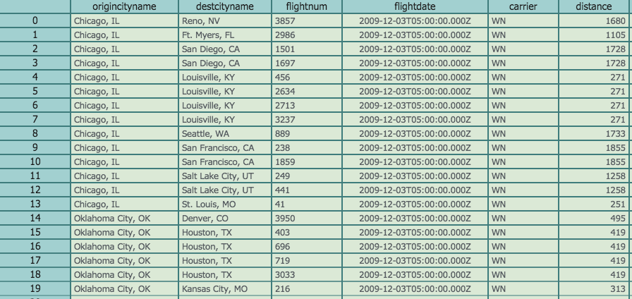

#Hypergrid example for displaying RDBMS data

this is an example usage of the hypergrid control looking at the +1MM row postrgres db example from the [greenplum getting started tutorial](http://gpdb.docs.pivotal.io/gs/42/pdf/GP-Getting-Started.pdf).  For this example to work you'll need to 

* install the [greenplum tutorial db](http://gpdb.docs.pivotal.io/gs/42/pdf/GP-Getting-Started.pdf
* npm install <a href="https://github.com/grncdr/node-any-db">any-db-postgress</a> and <a href="https://www.npmjs.com/package/websocket.io">websocket.io</a>
* run the node script found in this directory
* navigate to the q behavior <a href="http://openfin.github.io/fin-hypergrid/components/fin-hypergrid/demo.html">example</a> and press "reconnect"

feel free to connect this example to any other db that any-db supports (MS SQL, MySQL, Postgres, and SQLite3).
Make sure to npm install the proper any-db-***** interface and edit the config.js file.

